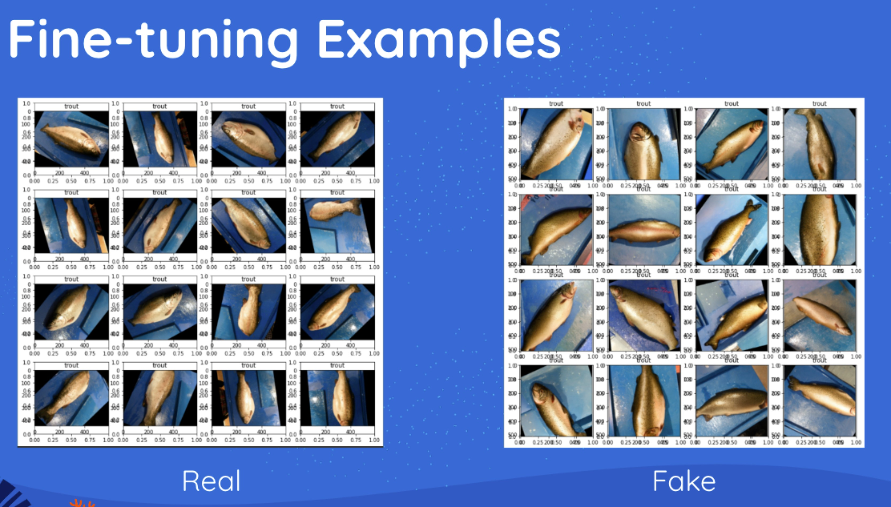
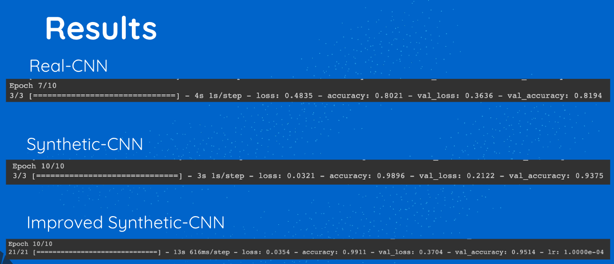

# FishSynthesis
1st place project at UCSC Santa Cruz AI challenge sponsored by Egnyte. 

An image classification task trained on output from Stable Diffusion's text-to-image model, fine-tuned on dreambooth. Trained on 5% of original data (150/9000) and synthetically generated results with impressive performance.

## Output
Output from fine-tuned Stable Diffusion model using Google Dreambooth. Look at notes section for sources and resources for your own experimentation. 

## Training Results
Results for training CNN on 150 real images -- Real-CNN

Results for training CNN on 150 real images plus synthetic data -- Synthetic-CNN

Results for Synthetic-CNN with better training practices (ReduceLROnPlateau, other Keras Callback features) -- Improved Synthetic CNN

## Resources/Notes

Kaggle dataset compiled from 300 generate images across 9 species of fish can be found here [Kaggle Dataset](https://www.kaggle.com/datasets/arnavkartikeya/fakefishdata)

Data use for generation and test are from [this kaggle dataset](https://www.kaggle.com/datasets/crowww/a-large-scale-fish-dataset).

Finetuned model uploaded as model uploaded as [HuggingFace Pipeline](https://huggingface.co/arnavkartikeya/fakedmarinedata). *Generating a single 512x512 image takes around 30 seconds on Colab Pro, the fakefishdata Kaggle Dataset was created on a Nautilus Cluster*

